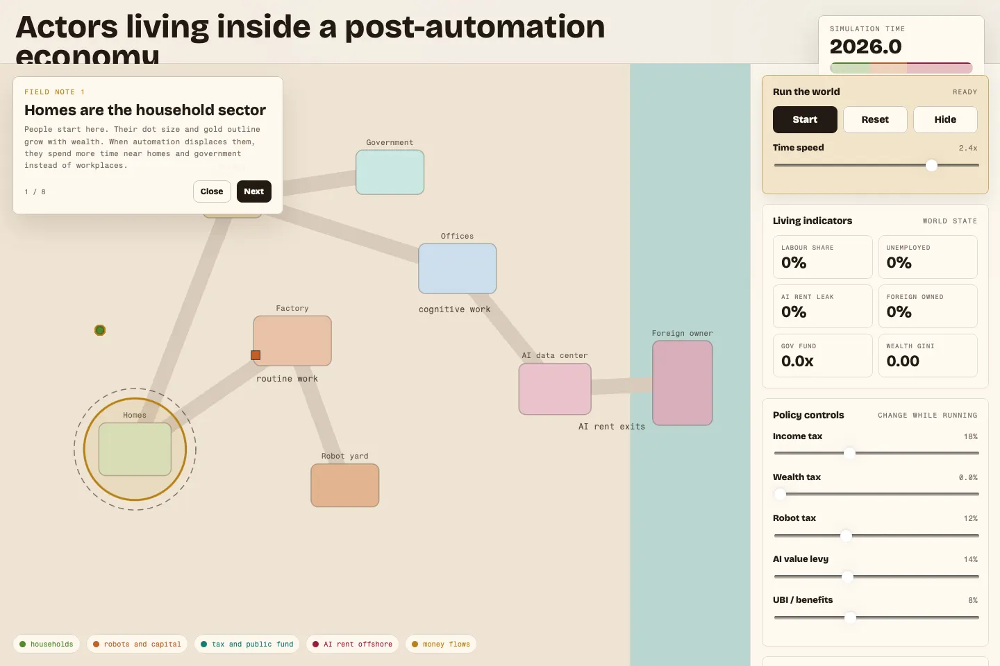

# Post-Automation World

An interactive 2D browser experiment inspired by arXiv `2606.20649v1`, "Simulating a Post-Automation Economy."

The project turns the paper's abstract economic model into a small living world. Households move between homes, factories, offices, markets, government, an AI data center, and a foreign owner. Time advances only after the user presses **Start**, and policy sliders let users see how taxes, UBI, automation, AI rent, public finances, and foreign ownership interact.



## Try It

Open `index.html` or `post_automation_world.html` in a browser.

The GitHub Pages deployment serves the interactive simulation from the repository root.

## What You Can See

- **Households** commute, earn wages, consume, save, and can become unemployed.
- **Robots and factories** represent physical automation and local capital income.
- **AI data center** creates competitive compute income plus mobile AI/IP rent.
- **Foreign owner** receives offshore rent when policy does not intercept it.
- **Government** collects taxes, pays transfers, and builds or drains a public fund.
- **Policy controls** adjust income tax, wealth tax, robot tax, AI value levy, UBI, and time speed.
- **Onboarding guide** introduces the map entities before the simulation starts.

## Files

- `index.html` - GitHub Pages entry point.
- `post_automation_world.html` - Main interactive 2D simulation.
- `assets/post-automation-world.webp` - Compressed screenshot used by this README.
- `post_automation_sim.py` - Python/uv model script for numerical experiments.
- `post-automation-simulation-concept.html` - Earlier visual concept explainer.

## Run The Python Model

The Python script uses `uv` script dependencies.

```bash
./post_automation_sim.py --scenario foreign_ai_untaxed
./post_automation_sim.py --compare --seeds 0 1 2 3 4
```

## Notes

This is an educational and exploratory simulation, not a forecast. The browser world is intentionally simplified so users can build intuition about the model's actors and flows. The Python script is closer to a numerical toy model, but still should be read as a transparent experiment rather than a validated economic forecast.
